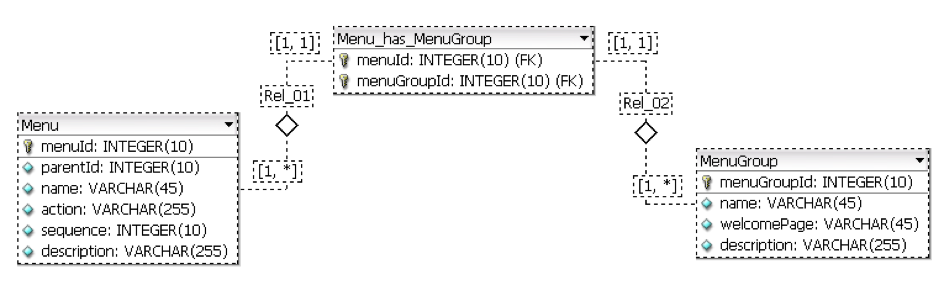

# ISPyB Developers Guide

## Table of contents

  * [Software required](#software-required)
  * [Installation](#installation)
  * [Installation on ispyb production machine](#installation-on-ispyb-prod-machine)
  * [Using Maven](#using-maven)
  * [Project Structure TODO](#project-structure-todo)
  * [First steps](#first-steps)
  * [Profiles: site specific files and configuration](#profiles-site-specific-files-and-configuration)
  * [Naming Conventions TODO](#naming-conventions-todo)
  * [Security](#security)
  * [Update ISPyB from SMIS database](#update-ispyb-from-smis-database)
  * [Archiving](#archiving)
  * [UML data model](#uml-data-model)
  * [Using junit testing TODO](#using-junit-testing-todo)
  * [Some hints](#some-hints)
  * [Versioning](#versioning)
  * [Graylog](#graylog)

## Software required

All the software required may be directly downloaded from internet

  * A Java SE Development Kit JDK 8
    * <http://www.oracle.com/technetwork/java/javase/downloads/index.html>

  * WildFly Application Server 8.2.0Final
    * <http://www.jboss.org/jbossas/downloads/>

  * Eclipse IDE for java EE developers (last version)
    * <http://www.eclipse.org/downloads/>
    * from eclipse interface connect to marketplace and fetch JBOSSTOOLS.

  * XDoclet 1.2.3
    * <http://xdoclet.sourceforge.net/xdoclet/install.html>

  * MySQL 5.X
    * <http://dev.mysql.com/downloads/mysql/5.2.html>

  * Axis1.4 libraries
    * <http://axis.apache.org/axis/>

## Installation

### Install on development platform WILDFLY 8.2

Firstly, the software above (see [Installation](#installation)) has to be
installed along with the definition of the following environment variables and
respective locations:

  * `JAVA_HOME=/java-jdks/jdk1.8.x.x`

  * `JBOSS_HOME=/jboss_root/wildfly-8.2Final`

Then, the project must be imported from GITHUB or other folder to Eclipse and the
respective paths referencing libraries corrected.

To avoid errors when using specified-type list, xdoclet 1.2.3 needs a small
fix: use `xjavadoc-1.5-snapshot050611.jar` to replace `xjavadoc-1.1.jar` in
xdoclet lib directory.  (Find this jar in the files directory on the forge.)
Remove the `xjavadoc-1.1.jar`.

Change `JBOSS_HOME/bin/standalone.conf` to adapt the `JAVA_OPTS`.

### Install on development platform WILDFLY 17.0.1

The current version of ispyb is compatible with Wildfly 17.0.1Final, the only changes should be done in the standalone.xml and concerns the datasource declaration.

You may also use the example of standalone-WF17.xml present in `/configuration/` to adapt it for you.

Comparing to the adaptation described below in this documentation for wildfly8.2, it should be updated as follows:

       <datasources>
            <datasource jndi-name="java:jboss/ispybconfigDS" pool-name="ispybconfigDS" enabled="true" use-java-context="true">
                <connection-url>jdbc:mysql://ispydb-server:3306/pyconfig?serverTimezone=Europe/Paris</connection-url>
                <driver>mysql</driver>
                <security>
                    <user-name>pxuser</user-name>
                    <password>*******</password>
                </security>
            </datasource>
            <datasource jndi-name="java:jboss/ispybDS" pool-name="ispybDS" enabled="true" use-java-context="true">
                <connection-url>jdbc:mysql://ispydb-server:3306/pydb?serverTimezone=Europe/Paris</connection-url>
                <driver>mysql</driver>
                <security>
                    <user-name>pxuser</user-name>
                    <password>*******</password>
                </security>
            </datasource>
            
            <drivers>      
                <driver name="mysql" module="com.mysql"/>
            </drivers
        </datasources>


### Database connection

Copy the `mysql` folder present from `/configuration/mysql` to the
`JBOSS_HOME/modules/system/layers/base/com` folder.

### Configuring standalone.xml

Save the original `standalone.xml` from
`JBOSS_HOME/standalone/configuration/standalone.xml` to
`JBOSS_HOME/standalone/configuration/standalone.xml.orig`.

Copy the `standalone.xml` ( or the `standalone.xml.simple` for simple authentication) present in `/configuration` to
`JBOSS_HOME/standalone/configuration`.

Customize it with your database as follows.

Update the datasources:

```xml
<datasource jndi-name="java:jboss/ispybconfigDS" pool-name="ispybconfigDS"
    enabled="true" use-java-context="true">
  <connection-url>jdbc:mysql://pydevserv.esrf.fr:3308/pyconfig</connection-url>
  <driver>mysql-connector-java-5.1.21.jar</driver>
  <security>
    <user-name>pxuser</user-name>
    <password>*****</password>
  </security>
</datasource>
<datasource jndi-name="java:jboss/ispybDS" pool-name="ispybDS"
    enabled="true" use-java-context="true">
  <connection-url>jdbc:mysql://pydevserv.esrf.fr:3308/pydb</connection-url>
  <driver>mysql-connector-java-5.1.21.jar</driver>
  <security>
    <user-name>pxuser</user-name>
    <password>*****</password>
  </security>
</datasource>
```

Change the drivers definition if needed:

```xml
<driver name="mysql-connector-java-5.1.21.jar" module="com.mysql"/>
```

Add a security domain:

```xml
<security-domain name="ispyb" cache-type="default">
  <authentication>
    <login-module code="ispyb.server.security.LdapLoginModule" flag="required">
      <module-option name="java.naming.factory.initial"
          value="com.sun.jndi.ldap.LdapCtxFactory"/>
      <module-option name="java.naming.provider.url"
          value="ldap://ldap.esrf.fr:389/"/>
      <module-option name="java.naming.security.authentication"
          value="simple"/>
      <module-option name="allowEmptyPasswords"
          value="false"/>
      <module-option name="principalDNPrefix"
          value="uid="/>
      <module-option name="principalDNSuffix"
          value=",ou=People,dc=esrf,dc=fr"/>
      <module-option name="groupUniqueMember"
          value="uniqueMember"/>
      <module-option name="groupAttributeID"
          value="cn"/>
      <module-option name="groupCtxDN"
          value="ou=Pxwebgroups,dc=esrf,dc=fr"/>
    </login-module>
  </authentication>
</security-domain>
```

Add a listener for ajp if needed:

```xml
<server name="default-server">
  <!-- ... -->
  <ajp-listener name="ajp" socket-binding="ajp" max-parameters="20000"/>
  <http-listener name="default" socket-binding="http" max-parameters="20000"/>
  <!-- ... -->
</server>
```

If you want to be able to edit directly the jsps without having to redeploy,
change:

```xml
<jsp-config/>
```

to:

```xml
<jsp-config development="true"/>
```

Configure the logging and add the user logged to every entry:

```xml
<formatter name="PATTERN">
  <pattern-formatter
      pattern="%d{yyyy-MM-dd HH:mm:ss,SSS} %-5p \[%c\] (%t) (userId %X{userId}) %s%e%n"/>
</formatter>
```

### Using HDF libraries

Create a module `hdfgroup` in:

```
modules/system/layers/base/org
```

to have:

```
modules/system/layers/base/org/hdfgroup/lib64
```

Copy into the `lib64` directory above the:

```
libjhdf.so  libjhdf.dll
libjhdf5.so libjhdf.dll
```

files present in `ispyb-parent/configuration/hdf5` folder.

Add the HDF5 config JVM OPTS in the `standalone.conf`:

```
-Djava.library.path=/ispyb/jboss/modules/system/layers/base/org/hdfgroup/lib64
```

### Increase JVM memory size

In the file `${JBOSS_HOME}/bin/standalone.conf`, replace

```
JAVA_OPTS="$JAVA_OPTS -Dprogram.name=$PROGNAME"
```

with (on local computer):

```
JAVA_OPTS="$JAVA_OPTS -Dprogram.name=$PROGNAME -Xms256m -Xmx1024m -XX:MaxPermSize=512m"
```

or on the production server with:

```
JAVA_OPTS="$JAVA_OPTS -Dprogram.name=$PROGNAME -Xms1024m -Xmx4096m -XX:MaxPermSize=1024m"
```

This is to avoid the "Out of Memory" error when processing big request to the
DB, per example with the update ISPyB from SMIS database process.

In Eclipse, double click on the server name in the sever window to open the
jboss overview, then click on "Open launch configuration" and add the above
parameters in the VM arguments.

#### Change the JBoss transaction timeout TODO

In the file

```
${JBOSS_HOME}/server/default/deploy/transaction-jboss-beans.xml
```

modify the `defaultTimeout` (300 by default):

```xml
<bean name="CoordinatorEnvironmentBean"
    class="com.arjuna.ats.arjuna.common.CoordinatorEnvironmentBean">

  <annotation>@org.jboss.aop.microcontainer.aspects.jmx.JMX(name="jboss.jta:name=CoordinatorEnvironmentBean", exposedInterface=com.arjuna.ats.arjuna.common.CoordinatorEnvironmentBeanMBean.class, registerDirectly=true)</annotation>

  <constructor factoryClass="com.arjuna.ats.arjuna.common.arjPropertyManager"
      factoryMethod="getCoordinatorEnvironmentBean"/>

  <property name="enableStatistics">false</property>
  <property name="defaultTimeout">900</property>
</bean>
```

This is to avoid the transaction timeout when running the cron job in charge of
the database update (WSClient).


## Using Maven

### Install maven 3.6.0

Configure your own `settings.xml` (copy the one from `configuration/` and update
the settings for you).

A part of the site profile are set in this file, see an example in
`documentation/settings.xml.example`.

### Import ISPyB

Import the ispyb-parent project.  In the project `ispyb-parent` you will find
the 6 projects:

  * `ispyb-ear`: contains the 3 followings modules as jars and wars, has to be
    deployed on the server.

  * `ispyb-ejb`: contains all the ejbs + some others classes like security,
    commons, hdf5, it contains also all the properties and the Constants class
    which will be used by `ispyb-ws` and `ispyb-ui` modules.

  * `ispyb-ui`: contains the "web client" part with all the web user
    interfaces, struts actions/forms, tiles, jsp, js, ...

  * `ispyb-ws`: contains all the webservices.

  * `ispyb-bcr`: contains the "web client" part of the bar code reader
    application used for the dewar tracking.

  * `ispyb-bcr-ear`: contains the preceding module as war and is linked to
    the `ispyb-ejb` through a dependency in the `pom.xml`, this module can be
    deployed or not separately from `ispyb.ear`.

In Eclipse, select "import project", then select the maven project and point to
the `pom.xml` of the `ispyb-parent`.

If some projects are missing, select once more "import project", maven project,
and point to the pom of the missing module.

Run maven install on the 4 modules.

ISPyB needs the third party libraries provided in the `dependencies` directory.
These don't exist in a public repository, so install them to the local Maven
repository so Maven can find them:

```
cd dependencies && mvn initialize
```

To use the BCR for dewar tracking:

```
mvn install:install-file -Dfile=dewarAPI.jar -DgroupId=ispyb -DartifactId=dewarAPI -Dversion=1.0 -Dpackaging=jar
```

### Webservices

Import the project `ispyb-WSclient-gen` to generate a jar containing the
classes built from wsdl.

Customize the `bindings.xml` file in `src/main/resources` to the correct wsdl
location.

### Environment and Site Customization

ISPyB is customized by its environment and site.

There are three environments (previously known as deployment modes)
for which ISPyB can be built and run: `production`, `development`, and
`test`.  The default environment is `development`.  Each environment has
a corresponding Maven profile named `ispyb.env-<environment>`, where
`<environment>` is the name of the environment.  These profiles allow
per-environment customization (e.g., JavaScript could be minified in the
`production` environment, but not in the `development` environment).  The
environment can be set via the `ispyb.env` system property; the allowed
values are the environment names.  By default, `ispyb.env` is set to the
name of the default environment: `development`.

To change the environment for the user invoking Maven, add
`-Dispyb.env=<environment>`, where `<environment>` is the name of the
desired environment, to the `MAVEN_OPTS` environment variable.

To change the environment for an invocation of Maven, add
`-Dispyb.env=<environment>`, where `<environment>` is the name of
the desired environment, to the Maven command line (e.g., `mvn
-Dispyb.env=production clean install`).

There are five sites for customizing ISPyB: `ESRF`, `EMBL`, `SOLEIL`,
`MAXIV`, and `GENERIC`.  The default site is `GENERIC`.  Each site has a
corresponding Maven profile named `ispyb.site-<site>`, where `<site>` is
the name of the site.  These profiles allow per-site customization (e.g.,
the ISPyB root folder location).  The site can be set via the `ispyb.site`
system property; the allowed values are the site names.  By default,
`ispyb.site` is set to the name of the default site: `GENERIC`.

To change the site for the user invoking Maven, add `-Dispyb.site=<site>`,
where `<site>` is the name of the desired site, to the `MAVEN_OPTS`
environment variable.

To change the site for an invocation of Maven, add `-Dispyb.site=<site>`,
where `<site>` is the name of the desired site, to the Maven command line
(e.g., `mvn -Dispyb.site=ESRF clean install`).


## Project Structure

### Overview

The project structure is divided in 3 big areas (the main folders):

  * `ispyb-ui`: contains all the client side files.

  * `ispyb-ejb`: contains all the server side files + commons + properties.

  * `ispyb-ws`: contains all the web services.

Besides that, there is one more folder in the project root:

  * `ispyb-parent`: is the parent folder, containing also some documentation
    and configuration files.

### Folder structure

#### ispyb-ejb

  * `src/main/java`

    Source classes for server side *Entity EJBs (CMPs)* and *Session Facade
    EJBs*.  Source classes for common classes.

  * `src/main/resources/META-INF`

    Persistence info:

      * `persistence.xml`

  * `db/scripts`

    Folder to store the sql scripts to generate, update the database structure
    and data.

#### ispyb-ui

  * `client/src`

    Source classes for client side: *Struts* *Actions* and *Forms* and others
    classes.

  * `client/build`

    Compiled classes from `client/src` folder.

  * `client/dist`

    War client file, which contains `client/build`, `client/generate/meta`,
    `client/lib` and `client/web` folders.

  * `client/etc/conf`

    Configuration files to be deployed in *WEB-INF* web application folder.  At
    the moment there are two files:

    * `authfilter.xml`: Authentication configuration for this web application.

    * `tiles-defs.xml`: Tiles definition file.

  * `client/etc/mergedir`

    Folder where are the files that will be mixed with the *XDoclet* generated
    tags defined in the files located in `client/src` folder to create the
    following files:

    * `jboss-web.xml`

    * `struts-config.xml`

    * `web.xml`

    For additional information about the names of the files to be put in
    this folder, consult the files with the names above and located in
    `client/generate/meta` folder.

  * `client/etc/resources`

    Folder where the resources properties are.

  * `client/generate/meta`

    XDoclet generated meta info. Contains web, Struts and Jboss descriptors:

    * `jboss-web.xml`

    * `struts-config.xml`

    * `validation.xml`

    * `web.xml`

  * `client/generate/src`

    This folder was not used at the moment of this manual.

  * `client/lib`

    Folder with the libraries used by the client. At the moment there are only
    struts framework libraries.

  * `client/web`

    This folder is the root of the web application and contains other
    subfolders:

    * `client/web/css`: Cascade style sheets files.

    * `client/web/images`: images.

    * `client/web/js`: js files:

      * `client/web/js/css`: all css used

      * `client/web/js/external`: external js used

      * `client/web/js/ispyb`: js files for ispyb:

        * `client/web/js/ispyb/biosaxs`: js files for biosaxs

        * `client/web/js/ispyb/min`: js file minified

        * `client/web/js/ispyb/mx`: js files for ispyb mx

        * `client/web/js/ispyb/utils`: js files utils

    * `client/web/tiles`: *JSPs* for tiles applications:

      * `client/web/tiles/bodies`: All bodies of the pages. In this folder
        there are several folders to better divide the different pages.

      * `client/web/tiles/common`: Common *JSPs* fragments to all website:

        * `client/web/tiles/common/footer`

        * `client/web/tiles/common/header`

        * `client/web/tiles/common/left`

      * `client/web/tiles/layouts`: *JSPs* with the layout definitions of the
        pages.

      * `client/web/WEB-INF`: Internal tld files for struts framework.

  * `client/applet/src`

    This folder contains the source of applets used in html pages. At the
    moment only exists one.

  * `client/applet/build`

    This folder contains the applets built.

  * `client/applet/lib`

    This folder contains all the JDLImage code modified to better fit our
    project and built in a jar file. This project is a courtesy of John
    Campbell (<http://www.ccp4.ac.uk/jwc/image_applet/ImageDisplay_ccp4.html>)
    and the source code is present on CVS.

#### ispyb-ws

  * `src/main/java`

    Source classes for webservices.

### Menu Structure

#### Database Model



#### How it works

There are three main tables:

  * `Menu`: contains the hierarchy of menus, menu target URL and menu name.

  * `MenuGroup`: Contains all sort of groups existing in ISPyB.

  * `Menu_has_MenuGroup`: Establish the relation m-n of the above tables.

However, just the two first tables are mapped as EJBs.

## First steps

### Server Side: First CMPs

To be filled with ejb3 automated generation or using ispyb templates.

The eclipse templates are found on `/server/etc/ispyb_templates.xml`.

See [How to configure ejb3 for ISPyB](ISPyB_ejb3.md).

The database connection shall be set in the `persistence.xml`
file which should be in `META_INF` of `ejb3.jar`, it is found on
`ispyb-ejb/src/main/resources/META-INF`.

### Client Side: First WebPages

#### Creating a simple page

This project uses Tiles for layout presentation.  Thus, instead of creating a
complete page with included tags repeatedly for every page (for instance, to
include header, footer and menus), we just create one part of the page.

For most of the pages associated to business functionalities a body is just
created. The rest of the layout of this page is defined in tiles configuration
file.

To create a simple text page it is needed to:

 1. Create a JSP with the body of the page and put it in
    `client/web/tiles/bodies/<content related folder>`.

 2. Create an entry with the page definition (`definition` tag with `extends`
    attribute) in `client/etc/conf/tiles-defs.xml`. It is necessary to define
    the name of the page, which layout it uses and fill in all the values
    defined in that layout. You can check the layout definition in the top of
    this xml file. For instance:

    ```xml
    <definition name="user.welcome.page" extends="site.main.layout" >
      <put name="title" value="ISPyB" />
      <put name="body" value="/tiles/bodies/welcome/user.jsp" />
      <put name="links" value="null" />
    </definition>
    ```

 3. Then, and because we cannot request a page in the way it has been
    previously defined, we have to create an action to call the new page (only
    if is called directly by http request). To that, we must create a new entry
    tag called `action` in `client/etc/mergedir/struts-actions.xml` which has
    two main attributes: `path`, the name requested in URL, and `forward`, the
    previous definition in `tiles-defs.xml`:

    ```xml
    <action
      path="/user/welcomeUserPage"
      forward="user.welcome.page"
      scope="request"
      validate="false"/>
    ```

#### Creating a form

To create a form submission page is necessary to create a page (a page with a
form) in the way like described above. The JSP body of this page has to contain
a struts form tag like:

```
<html:form action="<action name>.do">
```

where `<action name>` in the tag above is the action to be invoked when the
submit button is pressed.

This action is an **Action Class** and the form passed to it is the **Action
Form** and contains the data filled in the page form. Both definitions have to
be developed.

For the Form Action there are 3 possibilities to define it:

 1. If you don’t need JavaScript validation before submit the form, it can be
    defined in `client/etc/mergedir/struts-forms.xml` as a `DynaValidatorForm`.
    (See logon.)

 2. If you need JavaScript validation the easiest way to do it is coping the
    auto generated form file which is in `server/generate/form` to client
    source folder, modify it in order to have only the fields you need and add
    XDoclet `@struts.validator` tags for validation requirements.

 3. You can also simply copy one already existing.

All parameters passed through Action Form belong to the request.

Only one Form, `BreadCrumbForm`, is used to keep some parameters in the
session. These parameters will be displayed in the breadcrumbs bar at the top
of the body of the page to show useful information.

To code the action, create a new class in client source folder which extends
either `Action` or `DispatchAction` class and include on the top of it the
XDoclet definitions for this action:

  * `@struts.action`

    * `name`: Name of the form defined in `struts-forms.xml`.

    * `path`: `<name of the action>.do`.

    * `input`: Tiles definition page where the form is filled.

    * `parameter`: In case of using `DispatchAction`, this parameter is used to
      select the name of the method defined in the action class.

  * `@struts.action-forward`

    * `name`: Name of the forward returned by this action.

    * `path`: Tiles definition page to be forwarded.

#### Validation and Errors

Struts Layout only provides features for validation on server side.

The validation consists in putting messages in one queue (`ActionErrors`) which
uses a different name to index every entry:

  * `ActionErrors.GLOBAL_ERROR`: For global errors.

  * The name of the field in the form.

It's also important to use the `saveErrors` method to save only once the queue
on the request: `saveErrors(request, errors)`.

The following example is standard use of what has been described:

```java
public ActionForward displayFromMenu(ActionMapping mapping, ActionForm actForm,
    HttpServletRequest request, HttpServletResponse response) {

  ActionErrors errors = new ActionErrors();

  try {

    // ...

    // Check Required fields populated
    // The error queue is a parameter
    if (!this.validate(form, errors)) {
      ActionForward f =  mapping.findForward("shippingCreatePage");
      saveErrors(request, errors);
      return f;
    }

    // ...

    // EXAMPLE OF GLOBAL ERROR
    errors.add(ActionErrors.GLOBAL_ERROR, new ActionError("errors.detail",
        "Nah Nah Nah c'est pas bon"));

  } catch (Exception e) {
    errors.add(ActionErrors.GLOBAL_ERROR, new ActionError("errors.detail",
        e.toString()));
    ClientLogger.getInstance().error(e.toString());
  }

  saveErrors(request, errors);

  if (!errors.isEmpty()) {
    return (mapping.findForward("error"));
  }
  return mapping.findForward("shippingViewPage");
}

private boolean validate(ViewShippingForm form, ActionErrors errors) {
  boolean requiredFieldsPresent = true;

  if (form.getInfo().getProjectCode().length() == 0) {
    requiredFieldsPresent = false;
    ActionError actionError = new ActionError("errors.required",
        "Shipping Label");
    errors.add("info.projectCode", l_actionErrorPassword);
  }
  return requiredFieldsPresent;
}
```

## Profiles: environment- and site-specific files and configuration

The environment profiles are defined in the `pom.xml` file of the `ispyb-ejb`
module. Each environment profile contains all the properties for a specific
environment.

The site profile is defined in the `pom.xml` in `ispyb-ejb` module. The site
profile contains all the properties linked to a specific profile. See the
example of the `GENERIC` profile in the `pom.xml`.

For example it defines the `ispyb.site` property which value will be loaded
and used in the Constants class (`SITE_IS_ESRF()` or `SITE_IS_SOLEIL()`, or
`SITE_ATTRIBUTE` for example).

The properties are defined in `ISPyB.properties` present in the `ispyb-ejb`
module, and the correct values depend on the site where it is installed.
The values of the `ISPyB.properties` are replaced by those in the `pom.xml`
profile.

To override site properties for the user running Maven, add properties to
the `ispyb.site-<site>` profile, where `<site>` is the name of the desired
site, in the user's `settings.xml` file:

```xml
<!-- ... -->
<profiles>
  <!-- ... -->
  <profile>
    <id>ispyb.site-GENERIC</id>
    <activation>
      <property>
        <name>ispyb.site</name>
        <value>GENERIC</value>
      </property>
    </activation>
    <properties>
      <jboss.home>C:/java/appServers/wildfly-8.2.0.Final</jboss.home>
    </properties>
  </profile>
</profiles>
<!-- ... -->
```

Then, you have to customize the layout of the jsps according to your site
preferences.

You have to edit the following files of `ispyb-ui` module: `logon.jsp`,
`logo_bar.jsp`, `tab_bar.jsp`, `top_bar.jsp`, `context_bar.jsp`,
`unloggedLayout.jsp`. In these files use the `SITE_ATTRIBUTE` constant to
define what should be displayed in your case.

## Naming Conventions 

### Packages

#### Server Side 

All packages should have the prefix:

  * `ispyb.server.*`

The Entity and Facade EJBs should have the prefix:

  * `ispyb.server.data.`: for experiments database

  * `ispyb.server.config.`: for configuration database

#### Client Side 

All packages should have the prefix:

  * `ispyb.client.*`

### Actions

All Action classes should have the suffix:

  * `Action`

The name of the class has to be the same as the action name:

  * `<name>Action.java`

  * `<name>.do`

For example:

```java
/**
 * @struts.action path="/security/logon"
 */
public class LogonAction extends Action {
  // ...
}
```

### Tiles

All definitions created on `tiles-defs.xml` should have as name the prefix:

  * `<group name>.<menu name>.<identification name>.page`

For instance:

  * `user.shipping.container.create.page`

This **page** belongs to the **user** group, menu **shipping** and **creates**
a **container**.

## Security

### Security with JBOSS

JBoss has several predefined ways to do the authentication and authorization.

To take advantage of these features, an application-policy should be chosen
from `server/default/cong/login-config.xml` or a new one has to be developed
and configured in this file.

In the client side, the policy to apply should be defined in web application
`jboss-web.xml` which is created from compilation using the file
`client/etc/mergedir/jbossweb-resource-env-ref.xml`:

```xml
<!-- Configuration to ESRF: LDAP Module -->

<security-domain>java:/jaas/ispyb </security-domain>
<context-root>ispyb</context-root>
```

### ESRF LDAP Structure

Because LDAP configuration of the ESRF can not be used with standard LDAP
Module provided with JBOSS, a new LDAP module has been developed.

Following is described how to configure the authentication with the developed
LDAP Module.

ESRF LDAP configuration (all groups belonging to the group):

```
dn: ou=Pxwebgroups,dc=esrf,dc=fr
ou: Pxwebgroups
objectClass: top
objectClass: organizationalunit
```

Example of the User group:

```
dn: cn=User,ou=Pxwebgroups,dc=esrf,dc=fr
ou: Pxwebgroups
objectClass: top
objectClass: groupOfUniqueNames
cn: User
uniqueMember: uid=ifx999,ou=people,dc=esrf,dc=fr
uniqueMember: uid=mx9999,ou=people,dc=esrf,dc=fr
uniqueMember: uid=leal,ou=people,dc=esrf,dc=fr
```

See the entries added in `standalone.xml` in [Installation](#installation).


### Simple authentication

One of the aims of ISPyB is the portability and therefore the possibility of
using it in others facilities. The simple authentication is a built in module
which provides the same authentication schema as we use in ESRF LDAP. Its name
is `UsersRolesLoginModule`.

The policy should be added in the `standalone.xml` (see
[Installation](#installation)).

```xml
<application-policy name="simpleIspyb">

  <authentication>
    <login-module code="org.jboss.security.auth.spi.UsersRolesLoginModule"
        flag="required">
      <module-option
          name="usersProperties">users.properties</module-option>
      <module-option
          name="rolesProperties">roles.properties</module-option>
    </login-module>
  </authentication>

</application-policy>
```

Users and the respective passwords can be added in the following file
`wildfly-8.2.0.Final/standalone/configuration/users.properties` with the syntax:

```
<username>=<password>
```

The roles assigned to each user are defined in
`wildfly-8.2.0.Final/standalone/configuration/roles.properties` with the syntax:

```
<username>=<role>[,<role>...]
```

These are examples of both files:

  * `roles.properties`

    ```
    mx9999=User
    ifx999=User
    manager=User,Manager
    ```

  * `users.properties`

    ```
    mx9999=password1
    ifx999=password2
    manager=manager
    ```

### Roles

The roles are defined either directly in the properties file for simple authentication or in a particular group in the ldap authentication.

The roles are :

  * User : standard user which can be either a proposal account, or a user linked to several proposals through the table ProposalHasPerson.
  * Manager : manager account can see all proposals.
  * Localcontact : can see only the proposals where he/she is localcontact.
  * Store : special role dedicated to the dewar tracking feature.
  * WebService : used only to access through webservice.

Note that to be able to connect to ISPyB if a user has only the User Role, then at least one entry in the proposal table should exist.

You can test the login with a user having the Manager role if no data in your database.


### ISPyB Authorization and Authentication Model

The authentication method in ISPyB is based in the standard tomcat servlet:
`j_security_check`. See `tiles/bodies/logon/login.jsp` for more details.

The authorization method is based in URL patterns.

See `client/etc/mergedir/web-security.xml` for constraints and roles defined.

### Web service authentication

The web service authentication is done through ldap at ESRF:

```java
@RolesAllowed({ "WebService", "User", "Industrial"})
@SecurityDomain("ispyb")
@WebContext(authMethod="BASIC", secureWSDLAccess=false, transportGuarantee="NONE")
```

  * `@RolesAllowed` specifies the list of roles permitted to access web
    services.
  * `@SecurityDomain` references the application policy defined in the
    `standalome.xml` file.
  * `@WebContext` enables HTTP basic authentication.

## Update ISPyB from SMIS database

### Manual update

#### For each individual proposal

For each proposal account there is the possibility to update the database: all
sessions and samplesheets information concerning the proposal will be updated.

There is also the possibility to update only the samplesheet information.

#### For MXPress manager account

When logged as `fxmanage` it is possible to update the database for 1 or
several proposals and from/to specified dates.

### WSClient to update ISPyB from SMIS

WSClient is another eclipse java project which is saved on SVN.

It contains the client of the web service created from the class
`UpdateFromSMIS.java` of ISPyB project (`ispyb.server.smis`).

The class is `BatchUpdateFromSMIS.java`.

The client is called from a cron job on the ispyb machine every night (launched
at 04:12 am).

In the case this update fails, there is always the possibility to update
manually the database.

### Timeout

It is possible to change the timeout of the web service on the ispyb server
(see [Installation](#installation)).

## Archiving

At ESRF, data are archiving, but can be restored. See below the rules:

What will be archived are the subdirectories of `/data/pyarch/idXX` that have
names of proposals (e.g., `mx1234`). Criteria for archiving:

  * proposal end date or prolongation date older than XX months.

  * proposal has been restored for more than YY months XX and YY will be
    tuneable parameters, say 12 and 2 months, respectively.

Restorations will be done:

  * automatically as soon as a proposal be rescheduled or prolonged.

  * triggered by ISPyB upon user access. (On the data collection page,
    "Restore" button.)

Archiving will be done once a week. Once archived, the top-level directory
(e.g., `/data/pyarch/id14eh1/mx1234`) will be emptied, it permissions
changed so that only ISPyB can write to it (user jboss), and a single file
`.AUTO-ARCHIVED` created inside it.

If ISPyB needs a restoration, it will create a file `.RESTORE-PLEASE`
in the directory. Restoration will be performed ASAP and the both flags
(`.AUTO-ARCHIVED` and `.RESTORE-PLEASE`) removed. Original directory
permissions will be restored too.

## UML data model

The database model is written using DBDesigner (free download from
sourceforge). Then it is possible to connect to a MySQL database to update
either the database or the model, or to generate a new database.

When using dbdesigner, **do not use** standards inserts, and default values,
sometimes these lead to error when synchronising database with model.

## Using junit testing TODO

### Standalone mode

Copy the files `testJaas.config` and `standaloneClient.policy` of
`<ISPyB_project>/server/etc` to

```
jboss-6.1.0.Final/server/default/conf
```

### Testing

Write tests extending the EJB3Test.

## Some hints

JSP code: when using `"` inside a value = `"` use `\"` instead

### Start local JBoss using the machine name

Run JBoss with the option:

```
-b 0.0.0.0
```

## Versioning

If you are an ISPyB project maintainer, this is how a new version can be
made.

Use `versions:set` from the versions-maven plugin:

```
mvn versions:set -DnewVersion=5.0.0
```

If you are happy with the change:

```
mvn versions:commit
```

Otherwise:

```
mvn versions:revert
```

## Graylog

To log to Logstash[logstash], download [Logstash/Gelf
Loggers][logstash-gelf] which provides logging using the Graylog
Extended Logging Format (GELF) 1.0 and 1.1.

[logstash]: https://www.elastic.co/products/logstash
[logstash-gelf]: https://logging.paluch.biz/

Create a custom handler in WildFly's
`standalone/configuration/standalone.xml`:

```xml
<profile>
  <subsystem xmlns="urn:jboss:domain:logging:2.0">
  ...
  <custom-handler name="GelfLogger" class="biz.paluch.logging.gelf.wildfly.WildFlyGelfLogHandler" module="biz.paluch.logging">
    <level name="INFO"/>
    <properties>
        <property name="host" value="udp:graylog-dau.esrf.fr"/>
        <property name="port" value="12201"/>
        <property name="version" value="1.0"/>
        <property name="facility" value="ispyb-test"/>
        <property name="timestampPattern" value="yyyy-MM-dd"/>
    </properties>
  </custom-handler>
  ...
  <logger category="ispyb">
    <level name="INFO"/>
    <handlers>
        <handler name="ISPYB"/>
        <handler name="GelfLogger"/>
    </handlers>
  </logger>
</profile>
```
